# Tugas 2 - Array Function

## Identitas

- Nama : **Wadis Freandly**
- NIM  : **F1D02310094**

## Deskripsi Tugas

Tugas ini menerapkan enam metode penting pada Array JavaScript, yaitu `map()`, `filter()`, `reduce()`, `find()`, `some()`, dan `every()`. Data yang digunakan berupa sepuluh objek hobi pribadi. Setiap objek mempunyai nama hobi, jumlah jam per minggu, status kegiatan luar ruangan, dan kategori hobi.

## Cara Menjalankan

```bash
node arrayMethods_F1D02310094.js
```

## Implementasi

### map()

- Tujuan: membuat ringkasan teks berisi nama dan jumlah jam untuk setiap hobi.
- Screenshot kode:

  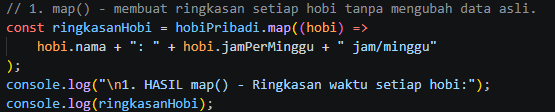

- Screenshot hasil eksekusi:

  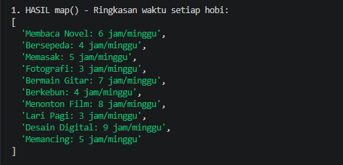

### filter()

- Tujuan: mengambil hobi luar ruangan yang dilakukan minimal empat jam per minggu.
- Screenshot kode:

  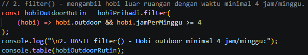

- Screenshot hasil eksekusi:

  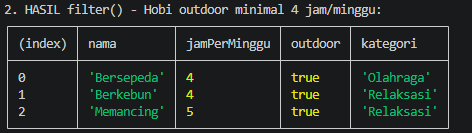

### reduce()

- Tujuan: menjumlahkan seluruh `jamPerMinggu` dari semua hobi.
- Screenshot kode:

  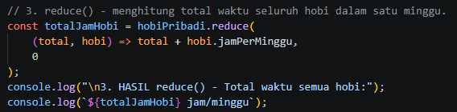

- Screenshot hasil eksekusi:

  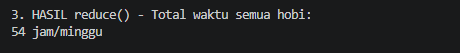

### find()

- Tujuan: menemukan objek hobi dengan nama `Fotografi`.
- Screenshot kode:

  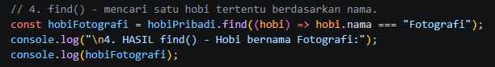

- Screenshot hasil eksekusi:

  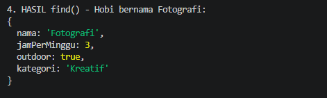

### some()

- Tujuan: memeriksa apakah ada hobi yang dilakukan minimal delapan jam per minggu.
- Screenshot kode:

  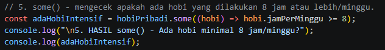

- Screenshot hasil eksekusi:

  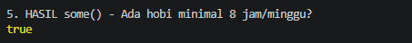

### every()

- Tujuan: memeriksa apakah seluruh nama hobi memiliki minimal lima karakter.
- Screenshot kode:

  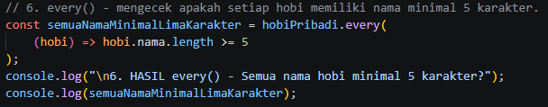

- Screenshot hasil eksekusi:

  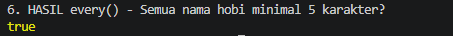

## Kesimpulan

`map()` dipakai untuk mengubah setiap elemen menjadi bentuk baru, sedangkan `filter()` memilih elemen yang memenuhi syarat. `reduce()` menggabungkan seluruh elemen menjadi satu nilai. Untuk pencarian, `find()` mengambil elemen pertama yang sesuai. `some()` bernilai `true` jika minimal satu elemen sesuai kondisi, sementara `every()` hanya bernilai `true` bila semua elemen memenuhi kondisi.
